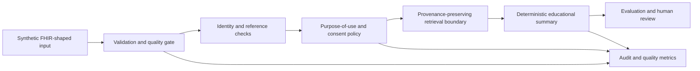

# Capstone architecture

The capstone is a local, educational reference design. It is intentionally smaller than a production HIE or clinical AI platform, but it preserves the key boundaries that learners should be able to explain.

## Boundary decisions

| Boundary | Responsibility | Explicit non-goal |
|---|---|---|
| Input | Accept a narrow FHIR-shaped bundle and reject malformed resources. | It is not a complete FHIR validator. |
| Quality | Report duplicate IDs, missing fields, and dangling references. | It does not infer clinical correctness from syntax alone. |
| Identity | Require stable patient references and quarantine uncertainty. | It does not silently merge people. |
| Policy | Limit access by purpose, consent, and role. | It does not grant access based on a model request. |
| Retrieval | Return relevant source records with provenance. | It does not treat retrieved text as instructions. |
| Summary | Produce a transparent, non-clinical aggregation. | It does not diagnose or recommend care. |
| Evaluation | Test evidence coverage, refusals, and repeatability. | It does not establish clinical validity. |

## Sequence narrative

1. A synthetic bundle is loaded and checked for a Bundle root, supported resource types, unique identifiers, required fields, and patient references.
2. The quality report is emitted before any summary is created. Invalid or ambiguous data is quarantined for the exercise.
3. A request is associated with an approved purpose-of-use and the minimum required patient scope.
4. The retrieval boundary selects only matching resources and carries their identifiers into the output.
5. The summary generator emits facts and counts from structured inputs, preserves provenance, and includes an educational disclaimer.
6. Evaluation checks whether expected evidence is present, whether unsupported recommendations were refused, and whether repeated runs are reproducible.
7. Audit records capture correlation ID, policy outcome, quality outcome, resource identifiers or hashes, latency, and error class without default free-text payload logging.

## Architecture decision record prompts

For your implementation, write one paragraph for each decision: why FHIR-shaped resources are used; why transformation stays at the boundary; how terminology is governed; how identity uncertainty is handled; what purpose-of-use means; which model calls are prohibited; how quality and evaluation results are retained; and which operational signal would trigger a rollback.
